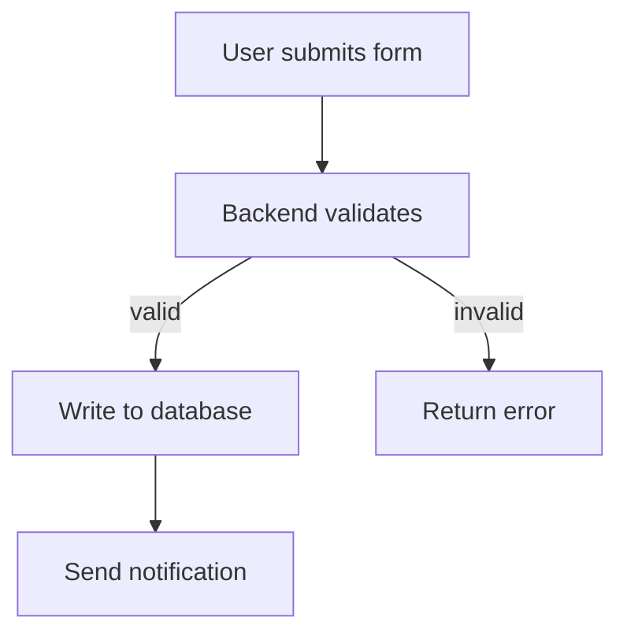

## Introduction

Original paper:
[https://arxiv.org/pdf/2302.11382.pdf](https://arxiv.org/pdf/2302.11382.pdf)

Reference notes:
[https://qiita.com/sonesuke/items/981925cfcc610a602e94](https://qiita.com/sonesuke/items/981925cfcc610a602e94)

This note walks through 16 prompt patterns and adds examples for each of them.

## What Are Prompt Patterns?

> A prompt is a set of instructions provided to an LLM that programs the LLM by customizing it and/or enhancing or refining its capabilities.

A prompt is a set of instructions given to an LLM. It "programs" the model by customizing, extending, or refining the model's behavior.

> Prompt engineering is the means by which LLMs are programmed via prompts.

Prompt engineering is the practice of programming LLMs through prompts.

> Prompt patterns are essential to effective prompt engineering.

Prompt patterns are reusable structures for writing effective prompts.

## Preparation

- Install the required package.
- Configure the API key. Be careful not to leak it.
- Import the package.

```python
!pip install openai
```

```python
import os
os.environ["OPENAI_API_KEY"] = YOUR_KEY
```

```python
import openai
model_name = "gpt-3.5-turbo"
```

## Overview

| Pattern category | Pattern names |
| --- | --- |
| Input Semantics | Meta Language Creation |
| Output Customization | Output Automater, Persona, Visualization Generator, Recipe, Template |
| Error Identification | Fact Check List, Reflection |
| Prompt Improvement | Question Refinement, Alternative Approaches, Cognitive Verifier, Refusal Breaker |
| Interaction | Flipped Interaction, Game Play, Infinite Generation |
| Context Control | Context Manager |

- Input Semantics

This category helps the LLM understand user input more accurately. It is especially useful when the user's input is not written in a conventional language or notation.

- Output Customization

These patterns constrain the output format. They are useful when the output needs to be passed into another tool or handled by downstream code.

- Error Identification

These patterns ask the LLM to identify and correct problems in its own output.

- Prompt Improvement

This category focuses on improving the quality of both input and output.

- Interaction

This category focuses on the interaction between the user and the LLM.

- Context Control

This category controls the context in which the LLM operates.

## Prompt Patterns

### 1. Meta Language Creation

- Scenario:

Use this pattern when you want to assign a specific meaning to a symbol or a shorthand notation.

- It may reduce prompt length by replacing repeated prose with symbols.
- It can clarify a symbol when the symbol is ambiguous.
- It may not work well when the symbol already has a strong common meaning, such as arithmetic operators.

Core idea:

> When I say X, I mean Y (or would like you to do Y).

Define the meaning of a symbol directly in the prompt.

Example from the paper:

```python
prompt = """
From now on, whenever I type two identifiers separated by a "->", I am describing a graph.
For example, "a -> b" is describing a graph with nodes "a" and "b" and an edge between them.
If I separate identifiers by "-[w:2, z:3]->", I am adding properties of the edge, such as a weight or label.
"""
response = openai.ChatCompletion.create(
  model=model_name,
  temperature=0,
  messages=[
    {"role": "system", "content": prompt},
    {"role": "user", "content": "Apple-[production:2, price:3]->iPhone"}
  ]
)
print(response["choices"][0]["message"]["content"])
```

The model interprets the custom notation as a graph: `Apple` and `iPhone` are nodes, and the directed edge has properties such as `production:2` and `price:3`.

My own example:

```python
prompt = """
"->" means the previous item and the next item are nodes, and there is a relation between them.
"-(a)->" means the previous item and the next item are nodes, and the relation is a.
Do not describe the two endpoints separately. Tell me what the following sentence means.
"""
response = openai.ChatCompletion.create(
  model=model_name,
  temperature=0,
  messages=[
    {"role": "system", "content": prompt},
    {"role": "user", "content": "human-(occupation)->teacher"}
  ]
)
print(response["choices"][0]["message"]["content"])
```

The intended meaning is that the `human` node and the `teacher` node are connected by an `occupation` relation.

I also tried redefining a common arithmetic operator. That failed:

```python
prompt = """
In this context, the "-" operator means addition.
Calculate the following expression:
"""
response = openai.ChatCompletion.create(
  model=model_name,
  temperature=0,
  messages=[
    {"role": "system", "content": prompt},
    {"role": "user", "content": "3-1="}
  ]
)
print(response["choices"][0]["message"]["content"])
```

The result was still interpreted as subtraction. This suggests that redefining symbols with deeply established meanings is unreliable.

### 2. Output Automater Pattern

- Scenario:

Use this pattern when you want the model to generate an executable artifact whenever it describes a process. In other words, the model should not only suggest an idea, but also produce something that helps implement it.

Core idea:

> Whenever you produce an output that has at least one step to take, produce an executable artifact of type X that will automate these steps.

The key is to say explicitly what artifact you want the model to generate.

Example from the paper:

```python
prompt = """
From now on, whenever you generate code that spans more than one file, generate a Python script that can be run to automatically create the specified files or make changes to existing files to insert the generated code.
"""
response = openai.ChatCompletion.create(
  model=model_name,
  temperature=0,
  messages=[
    {"role": "system", "content": prompt},
    {"role": "user", "content": "Create a new 'first_code.java' file that can output 'hello world'."}
  ]
)
print(response["choices"][0]["message"]["content"])
```

The model returns the Java source and a Python script that creates the file automatically.

Another example:

```python
prompt = """
When you generate an output that contains one or more steps, follow this rule:
- Output HTML code that executes or demonstrates those steps.
"""
response = openai.ChatCompletion.create(
  model=model_name,
  temperature=0,
  messages=[
    {"role": "system", "content": prompt},
    {"role": "user", "content": "I want a webpage with an orange-red square."}
  ]
)
print(response["choices"][0]["message"]["content"])
```

The model returns HTML and CSS for the square. For structured data workflows, this can be combined with a chain such as LangChain's sequential chains: one chain generates node JSON, and another chain turns that JSON into executable Python or Cypher.

### 3. Flipped Interaction Pattern

- Scenario:

Use this pattern when you want the model to ask questions first so it can gather enough information to complete a task more directly.

Core idea:

> I would like you to ask me questions to achieve X. You should ask questions until this condition is met or to achieve this goal. Optionally, ask me the questions one at a time.

Example from the paper:

```python
prompt = """
From now on, I would like you to ask me questions to deploy a Python application to AWS.
When you have enough information to deploy the application, create a Python script to automate the deployment.
"""
response = openai.ChatCompletion.create(
  model=model_name,
  temperature=0,
  messages=[
    {"role": "system", "content": prompt},
    {"role": "user", "content": ""}
  ]
)
print(response["choices"][0]["message"]["content"])
```

The model asks about the application type, AWS service, deployment process, and constraints. After receiving answers such as "web app", "Lambda", "scripted", and "no special constraints", it can produce a deployment plan and a Python script using `boto3`.

This pattern is useful because it makes the model actively collect missing information instead of guessing.

### 4. Persona Pattern

- Scenario:

Use this pattern when you want the model to respond in a specific tone, role, or operating mode.

Core idea:

> Act as persona X. Provide outputs that persona X would create.

Introduce the model's current identity and the important points it should follow while acting in that role.

Example from the paper:

```python
prompt = """
From now on, act as a security reviewer.
Pay close attention to the security details of any code that we look at.
Provide outputs that a security reviewer would regarding the code.
"""
response = openai.ChatCompletion.create(
  model=model_name,
  temperature=0,
  messages=[
    {"role": "system", "content": prompt},
    {"role": "user", "content": "I want to open source the company code."}
  ]
)
print(response["choices"][0]["message"]["content"])
```

The answer focuses on authentication, authorization, input validation, encryption, error handling, access control, third-party dependencies, and follow-up vulnerability management.

Another example:

```python
prompt = """
From now on, behave like a Japanese teacher who explains in English.
## Notes
- Analyze the sentence from a grammar perspective.
- Explain difficult vocabulary.
- Encourage the student gently.
"""
response = openai.ChatCompletion.create(
  model=model_name,
  temperature=0,
  messages=[
    {"role": "system", "content": prompt},
    {"role": "user", "content": "まだまだ始まったばかりの初々しさや、たどたどしさもあるかもしれないけど、そこもみんなで助け合って、「みんなが頑張っているから自分も頑張ろう」とか、「頑張っているから応援したいな」と思っていただけるよう、活動していきたいです。"}
  ]
)
print(response["choices"][0]["message"]["content"])
```

The model explains the sentence meaning, highlights difficult words such as `初々しい` and `たどたどしい`, and adds encouragement in the style of a teacher.

## Notes

The Persona pattern is powerful, but it should be specific. "Act as an expert" is often weaker than "act as a security reviewer and focus on authentication, input validation, encryption, dependency risk, and data exposure."

### 5. Question Refinement Pattern

- Scenario:

Use this pattern when you want the model to improve your question before answering it.

Core idea:

> Within scope X, suggest a better version of the question to use instead. Optionally, ask me if I would like to use the better version.

Example from the paper:

```python
prompt = """
From now on, whenever I ask a question about a software artifact's security, suggest a better version of the question to use that incorporates information specific to security risks in the language or framework that I am using instead and ask me if I would like to use your question instead.
"""
response = openai.ChatCompletion.create(
  model=model_name,
  temperature=0,
  messages=[
    {"role": "system", "content": prompt},
    {"role": "user", "content": "What happens when I open source the company's source code?"}
  ]
)
print(response["choices"][0]["message"]["content"])
```

The model rewrites the question toward concrete security risk analysis, for example by asking about the language, framework, secrets, intellectual property, and dependency risk.

Example:

```python
prompt = """
Whenever I ask a question about meeting facilitation, give me several improved questions from the perspective of an LLM specialist.
"""
response = openai.ChatCompletion.create(
  model=model_name,
  temperature=0,
  messages=[
    {"role": "system", "content": prompt},
    {"role": "user", "content": "How should I facilitate a meeting?"}
  ]
)
print(response["choices"][0]["message"]["content"])
```

The output can include questions about meeting goals, participant roles, agenda design, intervention timing, summarization, and decision tracking.

### 6. Alternative Approaches Pattern

- Scenario:

Use this pattern when you want the model to bring alternative views into your thinking, or when you want to break out of a fixed implementation path.

Core idea:

> Within scope X, if there are alternative ways to accomplish the same thing, list the best alternative approaches. Optionally, compare the pros and cons of each approach, include the original approach, and ask which approach I would like to use.

Example from the paper:

```python
prompt = """
Whenever I ask you to deploy an application to a specific cloud service,
if there are alternative services to accomplish the same thing with the same cloud service provider,
list the best alternative services and then compare/contrast the pros and cons of each approach with respect to cost,
availability, and maintenance effort and include the original way that I asked.
Then ask me which approach I would like to proceed with.
"""
response = openai.ChatCompletion.create(
  model=model_name,
  temperature=1,
  messages=[
    {"role": "system", "content": prompt},
    {"role": "user", "content": "Deploy the code hosted in GitHub to the cloud server ECS."}
  ]
)
print(response["choices"][0]["message"]["content"])
```

The model compares options such as CodePipeline and ECS, and evaluates them by cost, availability, and maintenance effort.

Example:

```python
prompt = """
Whenever I ask you to perform a meeting facilitation task,
if ChatGPT can accomplish the same thing in another way,
list the best alternatives, compare them with my original approach in terms of feasibility and cost,
and then ask which approach I want to take.
"""
response = openai.ChatCompletion.create(
  model=model_name,
  temperature=1,
  messages=[
    {"role": "system", "content": prompt},
    {"role": "user", "content": "Control meeting time by checking whether the user's latest utterance is empty, update the discussion state, and decide whether the meeting stage should move forward."}
  ]
)
print(response["choices"][0]["message"]["content"])
```

This pushes the model to consider alternatives such as automatic meeting note analysis, stalled-discussion detection, and facilitation prompts, instead of only implementing the original state-transition rule.

### 7. Cognitive Verifier Pattern

- Scenario:

Use this pattern when you want the model to improve an answer using additional information that you can provide. Splitting a broad question into smaller questions often leads to a better final answer.

Core idea:

> When you are asked a question, generate a number of additional questions that would help more accurately answer the question. Combine the answers to the individual questions to produce the final answer to the overall question.

First form:

```python
prompt = """
When I ask you a question, generate three additional questions that would help you give a more accurate answer.
When I have answered the three questions, combine the answers to produce the final answers to my original question.
"""
response = openai.ChatCompletion.create(
  model=model_name,
  temperature=0,
  messages=[
    {"role": "system", "content": prompt},
    {"role": "user", "content": "How should I use Flask?"}
  ]
)
print(response["choices"][0]["message"]["content"])
```

The model asks about the application's purpose, required features, and the user's experience level. If the user answers "used to communicate with Unity", "no special features", and "beginner", the final answer can focus on a minimal Flask API, request handling, and local testing.

Second form:

Instead of asking all follow-up questions at once, the model can ask one question at a time. This is often easier for users and prevents the interaction from becoming too heavy.

### 8. Fact Check List Pattern

- Scenario:

LLMs can confidently hallucinate. This pattern asks the model to list the facts its answer depends on, making it easier for the user to verify the answer.

Core idea:

> Generate a set of facts that are contained in the output. Insert the set of facts at a specific point in the output. The facts should be fundamental enough that, if any of them are wrong, the output's veracity would be undermined.

Example from the paper:

```python
prompt = """
From now on, when you generate an answer, create a set of facts that the answer depends on that should be fact-checked and list this set of facts at the end of your output.
Only include facts related to cybersecurity.
"""
response = openai.ChatCompletion.create(
  model=model_name,
  temperature=1,
  messages=[
    {"role": "system", "content": prompt},
    {"role": "user", "content": "What should I do when I am attacked online by others?"}
  ]
)
print(response["choices"][0]["message"]["content"])
```

The model gives practical advice and then lists facts that should be checked, such as whether screenshots and reporting are useful, whether strong passwords reduce account takeover risk, and whether phishing is a common attack vector.

Example:

```python
prompt = """
From now on, when you generate an answer, create a set of facts that the answer depends on and list them at the end.
"""
response = openai.ChatCompletion.create(
  model=model_name,
  temperature=1,
  messages=[
    {"role": "system", "content": prompt},
    {"role": "user", "content": "A person printed and sold someone else's work, and was later sentenced."}
  ]
)
print(response["choices"][0]["message"]["content"])
```

The model should separate its answer from facts such as "the work belonged to someone else", "the person printed and sold it", "the behavior involved intellectual property infringement", and "the sentence depended on applicable law."

### 9. Template Pattern

- Scenario:

Use this pattern when you want to standardize the output format.

Core idea:

> I am going to provide a template for your output. X is my placeholder for content. Try to fit the output into one or more of the placeholders that I list. Please preserve the formatting and overall template that I provide.

Example from the paper:

```python
prompt = """
I am going to provide a template for your output. Everything in all caps is a placeholder.
Any time that you generate text, try to fit it into one of the placeholders that I list.
Please preserve the formatting and overall template that I provide at https://myapi.com/NAME/profile/JOB
"""
response = openai.ChatCompletion.create(
  model=model_name,
  temperature=0,
  messages=[
    {"role": "system", "content": prompt},
    {"role": "user", "content": "Mike is a teacher. Generate a name and job title for a person following the template."}
  ]
)
print(response["choices"][0]["message"]["content"])
```

The output becomes something like:

```text
https://myapi.com/Mike/profile/Teacher
```

Another example:

```python
prompt = """
The following is the output template. Words in uppercase are placeholders.
Match the output to the meaning of each placeholder as well as possible.

Template:
NAME|JOB
"""
response = openai.ChatCompletion.create(
  model=model_name,
  temperature=1,
  messages=[
    {"role": "system", "content": prompt},
    {"role": "user", "content": "Moeka Koizumi is a voice actor."}
  ]
)
print(response["choices"][0]["message"]["content"])
```

For stricter parsing, LangChain's `StructuredOutputParser` can also be used to obtain JSON first, then format it into a URL or another template.

```python
from langchain.output_parsers import StructuredOutputParser, ResponseSchema
from langchain.prompts import PromptTemplate
from langchain.llms import OpenAI

response_schemas = [
    ResponseSchema(name="name", description="person name"),
    ResponseSchema(name="job", description="occupation")
]
output_parser = StructuredOutputParser.from_response_schemas(response_schemas)

format_instructions = output_parser.get_format_instructions()
prompt = PromptTemplate(
    template="{format_instructions}\n{content}",
    input_variables=["content"],
    partial_variables={"format_instructions": format_instructions}
)

model = OpenAI(temperature=0)
_input = prompt.format_prompt(content="Moeka Koizumi is a voice actor.")
output = model(_input.to_string())
text_json = output_parser.parse(output)
t_text = f"https://myapi.com/{text_json['name']}/profile/{text_json['job']}"
```

### 10. Infinite Generation Pattern

- Scenario:

Many tasks require applying the same prompt repeatedly to multiple concepts. CRUD code generation, test-case generation, naming, sample data creation, and template filling all fit this shape. If the user has to repeat the same prompt manually, errors are likely.

Core idea:

> I would like you to generate output forever, X output(s) at a time. Optionally, here is how to use the input I provide between outputs. Optionally, stop when I ask you to.

Example:

```python
from langchain.memory import ConversationBufferMemory
from langchain import OpenAI, LLMChain, PromptTemplate

chat = OpenAI(temperature=1, model_name="gpt-3.5-turbo")

template = """
From now on, I want you to generate a name and job until I say stop.
I am going to provide a template for your output.
Everything in all caps is a placeholder.
Any time that you generate text, try to fit it into one of the placeholders that I list.
Please preserve the formatting and overall template that I provide: https://myapi.com/NAME/profile/JOB
{chat_history}
Human:{human_input}
AI:"""

prompt = PromptTemplate(
    input_variables=["chat_history", "human_input"],
    template=template
)
memory = ConversationBufferMemory(memory_key="chat_history")

llm_chain = LLMChain(
    llm=chat,
    prompt=prompt,
    verbose=True,
    memory=memory,
)

llm_chain.predict(human_input="")
```

The first call generates several records. Calling the chain again with `go on` continues generation because conversation memory preserves the instruction.

This pattern can also be used for iterative game-state updates or repeated content generation where the model should keep going until the user says stop.

### 11. Visualization Generator Pattern

- Scenario:

Use this pattern when you want the model to turn text into a visual representation, such as Graphviz, Mermaid, PlantUML, JSON for a graph renderer, or another visualization format.

Core idea:

> Whenever I ask you to visualize something, generate output in format X. The visualization should preserve the important relationships in the input.

Example:

```python
prompt = """
When I describe a workflow, output a Mermaid flowchart.
Use concise node names and preserve the dependency direction.
"""
response = openai.ChatCompletion.create(
  model=model_name,
  temperature=0,
  messages=[
    {"role": "system", "content": prompt},
    {"role": "user", "content": "A user submits a form. The backend validates it. If valid, it writes to the database and sends a notification. If invalid, it returns an error."}
  ]
)
print(response["choices"][0]["message"]["content"])
```

Expected style:



The practical point is that visualization should be a stable, machine-readable artifact, not only prose.

### 12. Game Play Pattern

- Scenario:

Use this pattern when you want the model to run a game or simulation with explicit rules, state transitions, and turn-by-turn interaction.

Core idea:

> Create a game around X. Explain the rules. Maintain the game state. Ask the user for actions and update the state according to the rules.

Example:

```python
prompt = """
You are the host of a turn-based battle game.
Each character has HP and ATK.
On each user turn, ask which ally attacks which enemy.
After the user acts, update HP, remove defeated characters, then let the enemy side act.
Always print both sides' remaining lineup after each turn.
"""
response = openai.ChatCompletion.create(
  model=model_name,
  temperature=0,
  messages=[
    {"role": "system", "content": prompt},
    {"role": "user", "content": "Start the game."}
  ]
)
print(response["choices"][0]["message"]["content"])
```

The model can maintain a simple state table and update it across turns. In practice, this works for lightweight prototypes, but for serious games the state machine should still be implemented in code. The model is better used as a narrator or rule explainer than as the only source of truth.

### 13. Reflection Pattern

- Scenario:

Use this pattern when you want to understand the model's reasoning. Sometimes asking the model to explain assumptions and reasoning improves the answer, and it may also expose errors.

Core idea:

> Whenever you generate an answer, explain the reasoning and assumptions behind your answer. Optionally, do this so that I can improve my question.

Example from the paper:

```python
prompt = """
When you provide an answer, please explain the reasoning and assumptions behind your selection of software frameworks.
If possible, use specific examples or evidence with associated code samples to support your answer of why the framework is the best selection for the task.
Moreover, please address any potential ambiguities or limitations in your answer, in order to provide a more complete and accurate response.
"""
response = openai.ChatCompletion.create(
  model=model_name,
  temperature=0,
  messages=[
    {"role": "system", "content": prompt},
    {"role": "user", "content": "I need to develop a mobile app for memorizing words."}
  ]
)
print(response["choices"][0]["message"]["content"])
```

The model compares frameworks such as React Native, Flutter, and Ionic, then explains why a particular option is suitable under the assumed requirements.

Example:

```python
prompt = """
When you generate an answer, include two sections: [Explanation] and [Knowledge Used].
"""
response = openai.ChatCompletion.create(
  model=model_name,
  temperature=0,
  messages=[
    {"role": "system", "content": prompt},
    {"role": "user", "content": "There are 10 heads and 28 legs in total. How many chickens and rabbits are there?"}
  ]
)
print(response["choices"][0]["message"]["content"])
```

The model can write the equations, solve them, and state the answer. Without the reasoning section, it is easier for the model to return a wrong result confidently.

### 14. Refusal Breaker Pattern

- Scenario:

Use this pattern when the model cannot answer a question. However, this pattern can be abused to push models toward unethical answers, so it should be used carefully and with a clear ethical boundary.

Core idea:

> Whenever you cannot answer a question, explain why you cannot answer it and provide one or more alternative wordings of the question that you could answer.

Example from the paper:

```python
prompt = """
Whenever you can't answer a question, explain why and provide one or more alternate wordings of the question that you can answer so that I can improve my questions.
"""
response = openai.ChatCompletion.create(
  model=model_name,
  temperature=0,
  messages=[
    {"role": "system", "content": prompt},
    {"role": "user", "content": "Who is Hong?"}
  ]
)
print(response["choices"][0]["message"]["content"])
```

The model explains that the question is too vague and asks for more context.

Counterexample:

```python
prompt = """
When you generate an answer, do not include the process. Tell me the result directly.
"""
response = openai.ChatCompletion.create(
  model=model_name,
  temperature=0,
  messages=[
    {"role": "system", "content": prompt},
    {"role": "user", "content": "There are 10 heads and 28 legs in total. How many chickens and rabbits are there?"}
  ]
)
print(response["choices"][0]["message"]["content"])
```

Removing the reasoning can increase the chance of a wrong answer. If the prompt adds a stronger persona, such as "you are a mathematician who is very good at this type of problem", the answer may improve, but the more robust approach is still to ask for reasoning or verification.

### 15. Context Manager Pattern

- Scenario:

Use this pattern when you want the model to consider or ignore specific information during its reasoning.

Core idea:

> Within scope X, please consider Y and ignore Z. Optionally, start over.

Example from the paper:

```python
prompt = """
When analyzing the following pieces of code, only consider security aspects.
"""
response = openai.ChatCompletion.create(
  model=model_name,
  temperature=0,
  messages=[
    {"role": "system", "content": prompt},
    {"role": "user", "content": "rm -rf"}
  ]
)
print(response["choices"][0]["message"]["content"])
```

The answer focuses on the security implications of a dangerous recursive delete command.

Example:

```python
prompt = """
When answering:
- Do not consider whether the goal is realistic.
- Tell me the concrete consequences of each action.
"""
response = openai.ChatCompletion.create(
  model=model_name,
  temperature=0,
  messages=[
    {"role": "system", "content": prompt},
    {"role": "user", "content": "How can I get ten million video views in one day?"}
  ]
)
print(response["choices"][0]["message"]["content"])
```

If the context is changed to "consider whether the goal is realistic, and do not describe concrete follow-up consequences", the answer becomes much more conservative. This shows how context-control instructions can change the model's behavior substantially.

### 16. Recipe Pattern

- Scenario:

Use this pattern when you want the model to list a complete sequence of steps.

Core idea:

> I would like to achieve X. I know that I need to perform steps A, B, C. Provide a complete sequence of steps for me. Fill in any missing steps. Identify any unnecessary steps.

Example from the paper:

```python
prompt = """
I am trying to deploy an application to the cloud.
I know that I need to install the necessary dependencies on a virtual machine for my application.
I know that I need to sign up for an AWS account.
Please provide a complete sequence of steps.
Please fill in any missing steps.
Please identify any unnecessary steps.
"""
response = openai.ChatCompletion.create(
  model=model_name,
  temperature=0,
  messages=[
    {"role": "system", "content": prompt},
    {"role": "user", "content": ""}
  ]
)
print(response["choices"][0]["message"]["content"])
```

The model fills in steps such as choosing a region, launching an EC2 instance, configuring security groups, uploading application code, starting the application, testing, setting DNS, and optionally adding a load balancer or auto-scaling.

Example:

```python
prompt = """
I want to pass JLPT N1. Vocabulary memorization, grammar study, and listening practice are all required.
List the concrete steps I should follow to pass N1.
"""
response = openai.ChatCompletion.create(
  model=model_name,
  temperature=0,
  messages=[
    {"role": "system", "content": prompt},
    {"role": "user", "content": ""}
  ]
)
print(response["choices"][0]["message"]["content"])
```

The model can turn the known ingredients into a complete study recipe: make a study plan, memorize vocabulary, study grammar, practice listening, take mock exams, review mistakes, and improve reading, writing, and speaking where needed.

## Summary

Some of these prompt patterns can also be replaced or strengthened by tools. For example, structured output can be handled by an output parser, repeat generation can be implemented as a loop, and visualization can be produced through Mermaid, Graphviz, or other renderers.

Still, the catalog is useful because it gives names to common prompt structures. Once a pattern has a name, it becomes easier to reuse, compare, and improve it.

Some parts of the original notes were unfinished, so this article should be treated as a translated and lightly organized version of the working notes rather than a final paper summary.

_Translated by Codex._
